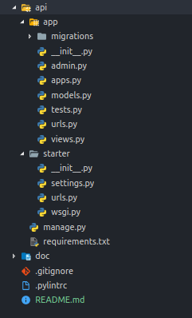

# Django REST API Starter
## Summary
The API half of the [React Django REST API Starter](https://github.com/zeevosec/react-django-rest-api-starter "React Django REST API Starter").

## Technologies, frameworks, and philosophy
* Django
* DRF (djangorestframework)
* Pylint


## Project Structure


## Usage

1. Start the API

```console
$ cd api
$ python manage.py migrate
$ python manage.py runserver
```

2. Visit a Starter endpoint at http://localhost:8000/api/title
